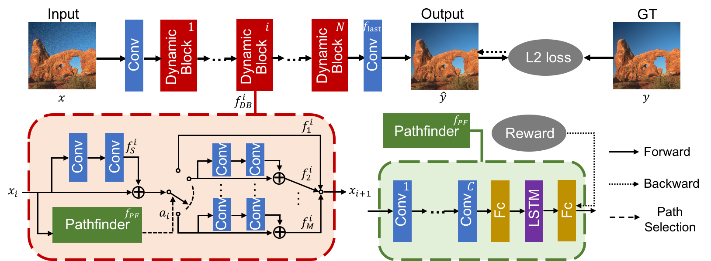

## Path-Restore [[DOI](https://doi.org/10.1109/TPAMI.2021.3096255)][[Project Page](https://www.mmlab-ntu.com/project/pathrestore/index.html)]

### Overview
- Path-Restore selects a specific network path for each image region.

### Citation
    @article{yu2021path,
     title={Path-Restore: Learning Network Path Selection for Image Restoration},
     author={Yu, Ke and Wang, Xintao and Dong, Chao and Tang, Xiaoou and Loy, Chen Change},
     journal={IEEE Transactions on Pattern Analysis and Machine Intelligence},
     year={2021},
     publisher={IEEE}
    }